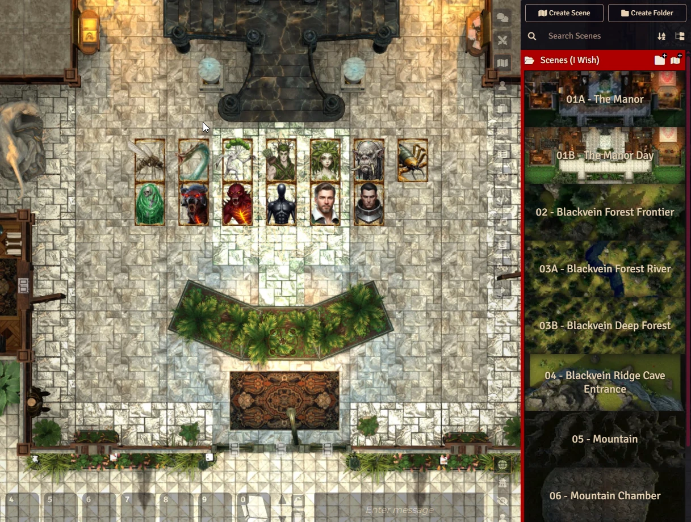

# I Wish (Daggerheart Adventure)
A wealthy merchant has been cursed and is doomed to die within a few weeks. The only hope of breaking the curse lies in a legendary artifact said to rest deep within a mountain. With time running out, the merchant is organizing one final expedition to retrieve the item—or die trying. He has summoned a group of remarkable individuals to undertake this perilous mission.

This module includes maps and npcs with art.

  

## About
- This adventure is designed to have drastic consequences, capable of significantly altering the world and the player characters. For this reason, it is ideally suited to be run as a one-shot (a single-session adventure). However, with the proper adjustments, it can be adapted into an ongoing campaign by GMs who wish to explore its long-term ramifications.
- The encounters and challenges in this adventure have been designed and balanced for a standard party of four adventurers. Feel free to adjust the difficulty of the encounters for larger or smaller parties by consulting the encounter balancing guidelines presented in the Core Rulebook.

# Instalation

## Search Foundry VTT Modules
1. Search for **I Wish (Daggerheart Adventure)**

## Instalação Manual
1. Go to **Modules** and use the link: 
https://raw.githubusercontent.com/brunocalado/i-wish-daggerheart-adventure/main/module.json

# How To 
Read the compendiums inside de module.

# Changelog
You can read changes at [CHANGELOG](CHANGELOG.md)

# License

This work is published under the terms of the Darrington Press Community Gaming (DPCGL) License, available at http://www.darringtonpress.com/license

The maps are from Dungeon Alchemist and are under their license: https://www.dungeonalchemist.com/terms-of-use

The token frame used belong to https://foundryvtt.com/packages/token-frames

The NPC images are done using AI. So, they are under https://creativecommons.org/publicdomain/zero/1.0/

# Mestre Digital
About this module creator: https://sites.google.com/view/mestredigitalmodules